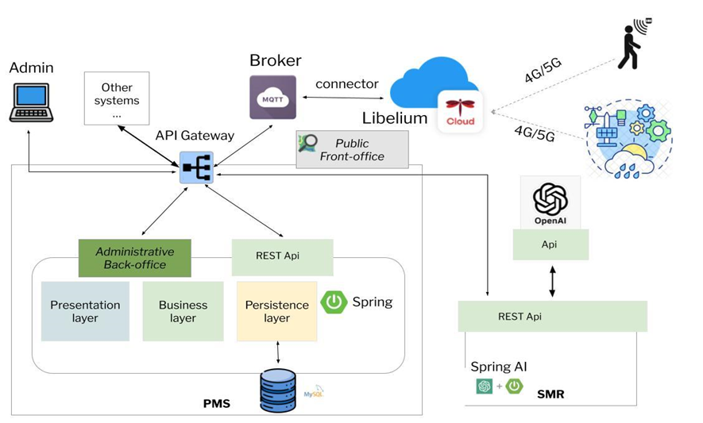

# Point of Interest Management System
## Table of Contents

- [Rasta PMS: A point of interest management system](#rasta-PMS-a-point-of-interest-management-system)
- [License](#license)
- [References](#references)

## Rasta PMS: A point of interest management system
Semantic enrichment and linking play an important role in improving Content Management Systems (CMS) and it also significantly improves the accuracy, personalization, and relevance of recommendations based on content managed by system administrators. In recent years, Apache Stanbol has played a pioneering role in improving semantic enrichment processes. As an open-source software package, Apache Stanbol was developed to provide semantic services and it has been used as integration for CMS, to facilitate the extraction, management, and use of semantic information from various sources. Existing predefined integrations exist for famous CMS, e.g., WordPress, but they do not offer room for customization in case the CMS is self-hosted and self-developed. Even though Apache Stanbol provides useful and relevant features, due to some limitations it shows, such as the project dismissal and considering the evolving landscape of digital content and the increased demand for more advanced and context-aware semantic enrichment processes, the exploration of new technologies is required. In this respect, Large Language Models (LLMs), such as GPT-3 and its successors, are promising candidates for offering semantic enhancement functionalities. We report on our initial exploration of the latest technologies, such as LLMs, for semantic enrichment and we report our preliminary experience in the context of the RASTA project. In some existing works, LLMs have been used for different purposes than exploring them in the context of semantic enrichment.  In this task, we used ChatGPT Assistant API to investigate how to exploit it for performing semantic enrichment and semantic linking of content management systems.

Briefly, the systems implemented in the other ORs will use the CMS (also named PMS) as a base and integrate other services such as a Travel Planner and further extension of it with a Recommender System. It will also make use of both data from sensors of various kinds (e.g. Weather Stations) and open data and integrate graph analytics algorithmic technologies to support tourism flow analysis.  Specifically, the systems developed in other ORs are focused on the personalization of provided tourism recommendations through automatic semantic enrichment of the content related to the specific context where the TRS is used.  
Basically, any relevant content about Points of Interest (POIs) and itineraries of the execution context of the TRS, such as a Smart City or a Natural Park, can be semantically enhanced, thus improving the recommendations. Our work mainly focuses on the realization and integration of a Content Management System (CMS) and a Semantic Metadata Repository (SMR).

The CMS will allow system administrators to insert their context-related content and display it to the public, as well as offering integrations with other systems. The SMR is, instead, used to automatically enrich existing content with content retrieved from external resources, with a reduction of effort and time in providing extensive information on the POIs. The PMS is then composed of an administrative Back-office offering CRUD (create-read-update-delete) functionalities on the POIs. This system will have a front office made of web forms and data tables for displaying data and also a public front office to show the user interface with maps.

The SMR is proposed to be implemented with a LLM and the integration with the OpenAI API is offered through Spring AI, being the PMS developed with the Spring ecosystem. Lastly, an IoT infrastructure can enrich POIs information with real time data coming from sensors, e.g., weather, crowd monitoring, etc. The PMS will offer integration of the available data so the informative area can offer additional real-time related information. Depending on the chosen technology, an MQTT broker will collect data and re-publish them after reworking, cleaning, and storing them.
The figure shows an overview of the assistive modeling tool along with its workflow.

To install the Rasta PMS tool, please follow [Installation Guide](/Install.md).

**Once the application is running, open a browser and type [http://localhost:8080/rastapms](http://localhost:8080/rastapms)**
**For the private pages use the admin, admin credentials.**

## License
Rasta PMS is Open Source software released under the [Apache 2.0 license](/LICENSE.md).

## Gran Sasso Science Institute Team
- Sadia Azam
- Martina De Sanctis
- Amleto Di Salle
- Ludovico Iovino
- Claudio Pompilio

